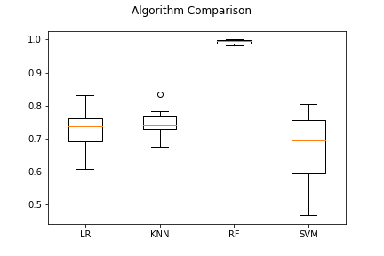

# machine-learning-challenge - Exoplanet Exploration

## Background

Over a period of nine years in deep space, the NASA Kepler space telescope has been 
out on a planet-hunting mission to discover hidden planets outside of our solar 
system.
The machine learning models in this jupyter notebook can classify candidate exoplanets 
from the raw dataset.

In this homework assignment, you will need to:

1. [Preprocess the raw data](#Preprocessing)
2. [Tune the models](#Tune-Model-Parameters)
3. [Compare two or more models](#Evaluate-Model-Performance)

## Steps ##

### Preprocess the Data

* Preprocess the dataset prior to fitting the model.
* Perform feature selection and remove unnecessary features.
* Use `MinMaxScaler` to scale the numerical data.
* Separate the data into training and testing data.

### Tune Model Parameters

* Use `GridSearch` to tune model parameters.
* Tune and compare at least two different classifiers.

# Comparison Between Models #

## Logistic Regression Model ##

Logistic Regression (accuracy = 0.3852080123266564)

                 precision    recall  f1-score   support

     CANDIDATE       0.34      0.92      0.49       422
FALSE POSITIVE       0.77      0.13      0.22       876

      accuracy                           0.39      1298
     macro avg       0.55      0.52      0.36      1298
  weighted avg       0.63      0.39      0.31      1298

## Random Forest Model ##

Random Forest (accuracy = 0.9946070878274268)

                 precision    recall  f1-score   support

     CANDIDATE       0.99      1.00      0.99       422
FALSE POSITIVE       1.00      0.99      1.00       876

      accuracy                           0.99      1298
     macro avg       0.99      0.99      0.99      1298
  weighted avg       0.99      0.99      0.99      1298

## KNN Model ##

KNN (accuracy = 0.674884437596302)

                 precision    recall  f1-score   support

     CANDIDATE       0.00      0.00      0.00       422
FALSE POSITIVE       0.67      1.00      0.81       876

      accuracy                           0.67      1298
     macro avg       0.34      0.50      0.40      1298
  weighted avg       0.46      0.67      0.54      1298

## SVM Model ##

SVM (accuracy = 0.5600924499229584)

                  precision    recall  f1-score   support

     CANDIDATE       0.99      1.00      0.99       422
FALSE POSITIVE       1.00      0.99      1.00       876

      accuracy                           0.99      1298
     macro avg       0.99      0.99      0.99      1298
  weighted avg       0.99      0.99      0.99      1298

## Result ##

The best model to use on this study is Random Forest Model due to its high accuracy
which is 0.9946070878274268.